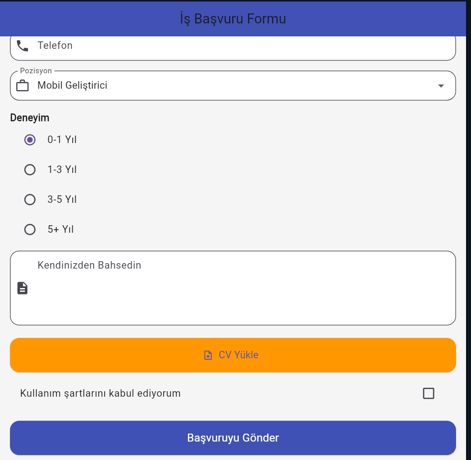

# Flutter İş Başvuru Formu

Bu proje, Flutter ve Dart kullanılarak geliştirilmiş, modern ve kullanıcı dostu bir **İş Başvuru Formu** arayüzüdür. Adayların kişisel bilgilerini, başvurdukları pozisyonu ve deneyimlerini kolayca iletebilmeleri için tasarlanmıştır.

## Ekran Görüntüsü



## Proje Hakkında ve Özellikler

Bu uygulama, Flutter'daki temel form yönetimi (Form, GlobalKey) ve Material Design widget'larının kullanımını göstermektedir. Proje içerisinde yer alan başlıca özellikler şunlardır:

* **Kişisel Bilgi Alanları:** Ad Soyad, E-posta ve Telefon numarası için ikonlu, özel tasarımlı ve doğrulama (validation) kurallarına sahip metin giriş alanları (`TextFormField`). Boş bırakıldığında kullanıcıyı uyarır.
* **Pozisyon Seçimi:** Adayların uzmanlık alanlarını (Mobil, Frontend, Backend, UI/UX) belirleyebileceği şık bir açılır menü (`DropdownButtonFormField`).
* **Deneyim Belirleme:** Çalışma sürelerini seçmek için durum yönetimi (`setState`) ile entegre edilmiş radyo düğmeleri (`RadioListTile`).
* **Kendinden Bahsetme:** Adayların ön yazılarını ekleyebileceği çok satırlı (multiline) metin kutusu.
* **CV Yükleme:** Dosya yükleme eylemini temsil eden, ikonlu ve belirgin bir "CV Yükle" butonu (`ElevatedButton.icon`).
* **Kullanım Şartları Onayı:** Formun başarılı bir şekilde gönderilebilmesi için zorunlu tutulan onay kutucuğu (`CheckboxListTile`).
* **Geri Bildirimler (SnackBar):** Form gönderim işlemi sırasında form kurallarının ihlali, sözleşmenin kabul edilmemesi veya işlemin başarılı olması durumlarında kullanıcıya alt kısımdan beliren mesajlar (`SnackBar`) ile geri bildirim verilir.

## Kullanılan Teknolojiler ve Bileşenler

* **Dil:** Dart
* **Framework:** Flutter
* **Mimari / Durum Yönetimi:** `StatefulWidget` üzerinden lokal durum (State) yönetimi
* **Önemli Widget'lar:** `Scaffold`, `Form`, `TextFormField`, `DropdownButtonFormField`, `RadioListTile`, `CheckboxListTile`, `SnackBar`

## Kurulum ve Çalıştırma

1. Projeyi bilgisayarınıza klonlayın:
   ```bash
   git clone <repository_url>
